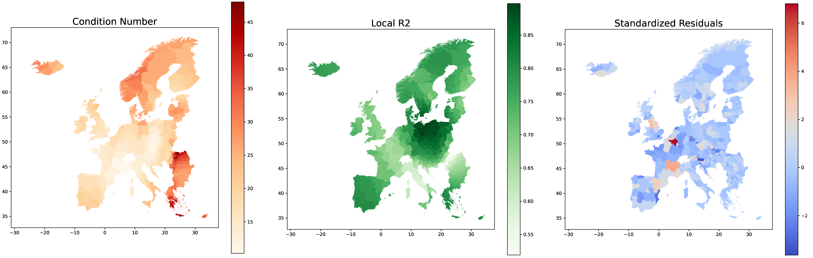

# Covid-19 - Tools and Notebooks for Geographic Analysis

## Animation of Infection Rates
Visualizing Covid-19 infection rates over time can be done in a single animation. The animation is made by loading a CSV file as a pandas dataframe and plotting each column with a world shapefile, the maps can then be combined in to a single gif.  
Infection data for the world animation is *the daily number of new reported COVID-19 cases and deaths worldwide* from the [European Centre for Disease Prevention and Control](https://www.ecdc.europa.eu/en/publications-data/download-todays-data-geographic-distribution-covid-19-cases-worldwide)

Similar animations can likewise be made for regions in the European union or municipalities on a country level. 
   |  
:---:|:---:

Bi-weekly infection rates for the European Regions are from the *Data on the weekly subnational 14-day notification rate of new COVID-19 cases* from the [ECDC](https://www.ecdc.europa.eu/en/publications-data/weekly-subnational-14-day-notification-rate-covid-19). 
Data on daily municipal infection rates in Denmark are from [Statens Serum Institut (SSI)](https://covid19.ssi.dk/overvagningsdata/download-fil-med-overvaagningdata)   

To ensure a fixed legend a dummy feature is included in the data and in the shapefile outside the mapview. Find shapefiles and CSV-files in the *Data* folder, the animation scripts are located in the *Notebook/Animations* folder.

## Exploratory Data Analysis (ESDA) - Spatial Autocorrelation
The spatial autocorrelation analysis checks for spatial distribution of the infection rates in the included regions. The tool locates hot- and coldspots of infection rates, together with doughnuts and diamonds  - being regions with low infection rates sorrounded by high infection rates and vice versa. 

 | 
:---:|:---:

The spatial autocorrelation analysis can be done with accumulated infection rates with the purpose of locating the clusters of the pandemic as a whole. To visualize how the patterns of clusters has changed over time, all the individual time steps can be visualized in a single animations.  
The spatial autocorrelation notebook contains tools to carry out the analysis. Under *Notebooks/Animations* is the script for making a hot- and coldspot animation.

## Emerging Hotspot Analysis
The emerging hotspot analysis, inspired by [ESRI](https://pro.arcgis.com/en/pro-app/latest/tool-reference/space-time-pattern-mining/emerginghotspots.htm) , is a method that utilize a three dimensional data set to locate clusters through both time and space. By doing a spatial autocorrelation analysis for each time slot of the  data and adding these as layers on top of each other, it is possible to analyze how hot and coldspots change in space over time. The method presented in this repository is a simplified version of the ESRI tool and runs in Python alone and outputs a shapefile that can be visualized in QGIS, find the script and QGIS-styling file in the Notebooks folder. 

The emerging hotspot analysis can be implemted over different timespans, as long as a reasonable number of time steps are included. The tools is very usefull in identifying the different categories of hot and coldspots and hereby also locate emerging hot and coldspots, this could for example be done by looking at daily infection rates one month back or for a specific timeframe.

 | 
:---:|:---:

## Geographic Weighted Regression
A notebook for Geographic Weighted Regression is located in the Notebook folder. This notebook inputs a shapefile with infection numbers and a set of variables and outputs GWR statistics together with maps of variable significance, coefficients and GWR evaluation metrics (Local R2, Standardized Residuals and Condition Number)

Plotting how and where the 5 most signifcant variables are explanatory in explaining regional infection rates. Below are examples of the evaluation metric plots that can be created in the notebook.

## Machine Learning Prediction
